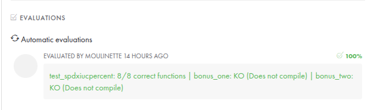

# ft_printf

A custom implementation of the C `printf` function, developed as part of the 42 school curriculum. This project demonstrates handling variadic functions, custom formatting, and integration with a personal `libft` library.

</img>

## Features

- Supports basic format specifiers: `%c`, `%s`, `%p`, `%d`, `%i`, `%u`, `%x`, `%X`, and `%%`
- Handles variadic arguments using `stdarg.h`
- Integrates with a custom [libft](libft/) library for utility functions
- Includes a modular and maintainable code structure
- Custom Makefile for building both `ft_printf` and `libft`

## Project Structure

- [`ft_printf.c`](ft_printf.c): Main implementation of `ft_printf`
- [`ft_print_str.c`](ft_print_str.c): String printing logic
- [`ft_print_nbr.c`](ft_print_nbr.c): Integer printing logic
- [`ft_print_unbr.c`](ft_print_unbr.c): Unsigned integer printing logic
- [`ft_print_ptr.c`](ft_print_ptr.c): Pointer printing logic
- [`ft_print_hex.c`](ft_print_hex.c): Hexadecimal printing logic
- [`ft_printf.h`](ft_printf.h): Header file with function prototypes and macros
- [`libft/`](libft/): Custom utility library used by `ft_printf`
- [`Makefile`](Makefile): Build instructions for the project

## What I Learned

- 📚 **Variadic Functions:**  
  Learned how to use `va_list`, `va_start`, `va_arg`, and `va_end` to handle functions with a variable number of arguments.
- 🛠️ **How printf Works:**  
  Gained insight into the internal workings of the standard `printf` function, including parsing format strings and handling different data types.
- 🏗️ **Complex Makefiles:**  
  Improved my skills in writing and maintaining Makefiles, especially integrating an external library (`libft`) into the build process.
- 🧠 **Logic and Problem Solving:**  
  Enhanced my logical thinking by breaking down the problem into smaller, manageable parts and implementing each format specifier.
- 🔢 **Number Conversions:**  
  Implemented functions to convert numbers between different bases, such as decimal to hexadecimal, and handled edge cases for each conversion.

## Building

To build the project, simply run:

```
make
```

This will compile both `libft` and `ft_printf`, producing `libftprintf.a`.

## Usage

Include `ft_printf.h` in your project and link against `libftprintf.a`.

```
cc <.c files> -L. -lftprintf
```
